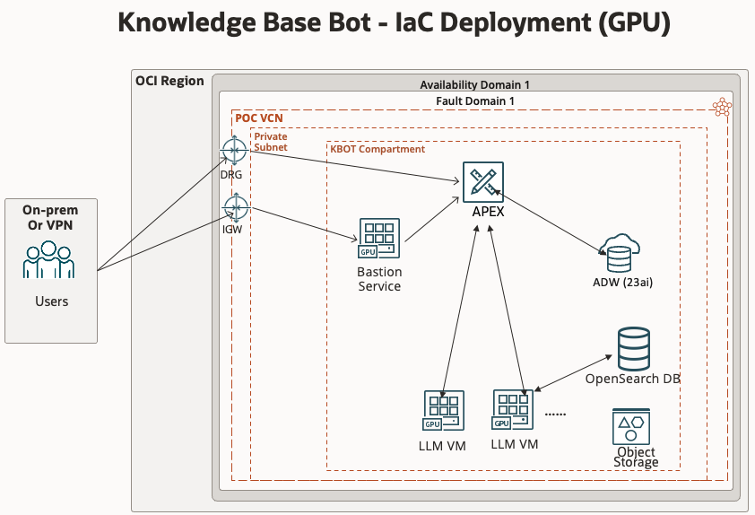

# Getting Started with OCI KBOT 

This guide helps you install and use **KBOT Infrastructure**.

1. Ensure you have the correct IAM policies in place.
2. Deploy a dedicated **KBOT Infrastructure** stack.
   - this stack imports a cusotm image so first time may run ~10min longer
3. Clean up resources when you’re done.

---

## Step 1: Set Up Policies in Your Tenancy

1. If you are **not** a tenancy administrator, ask your admin to set up the required policies in the **root compartment** --> "allow <your_group> to manage all-resources in compartment <kbot_deployment_compartment>"
2. If you **are** a tenancy administrator, Resource Manager will typically deploy the minimal required policies automatically, but you can reference the same IAM policies as in #1 for advanced or custom configurations if needed.

---

## Step 2: Deploy the KBOT infrastructure

1. Click **Deploy to Oracle Cloud** above.
2. In **Create Stack**:
   - Give your stack a **name** (e.g., _kbot-stack_).
   - Select the **compartment** where you want OCI KBOT deployed.
   - Provide any additional parameters (such as node size, node count) according to your preferences.
3. Click **Next**, then **Create**, and finally choose **Run apply** to provision your cluster.
4. Monitor the progress in **Resource Manager → Stacks**. Once the status is **Succeeded**, you have a functional 2 x A10 GPU VMs, APEX/ADB, OpenSearch Cluster, OBject Store bucket and Bastion Service to host and work with OCI AI KBOT.

## Cleanup

When you are finished, you can remove the resources you created in **two steps**, in this order:

1. **Destroy the OCI AI KBOTs Stack**

   - Go to **Resource Manager → Stacks** in the OCI Console.
   - Select the stack you used to install **OCI AI KBOT** (from Step 3).
   - Choose **Terraform Actions → Destroy**, confirm, and wait until the job succeeds.

Following this order ensures you do not have leftover services or dependencies in your tenancy. Once both stacks are destroyed, your tenancy will be free of any OCI AI KBOT-related resources.

---

## Need Help?

- For questions or additional support, contact [adam.szynkowski@oracle.com](mailto:adam.szynkowski@oracle.com).